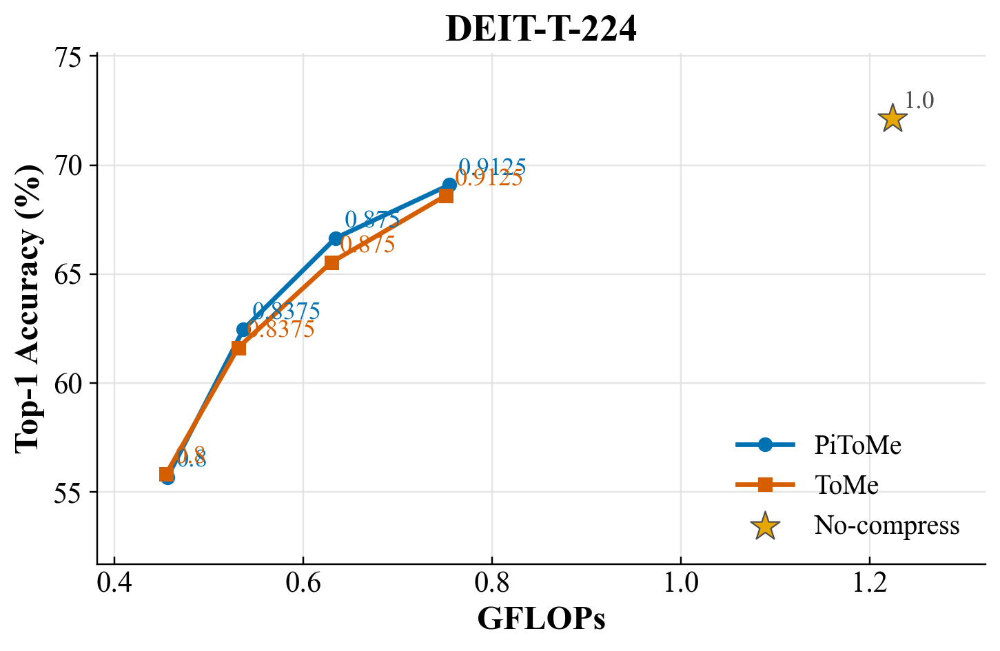
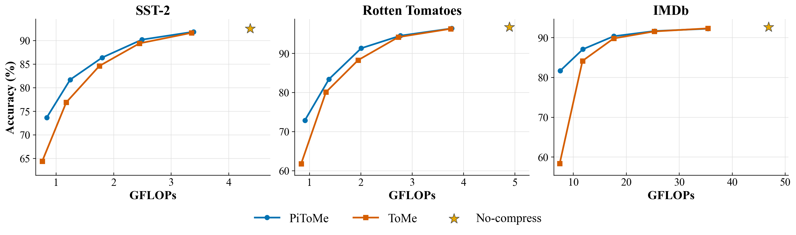
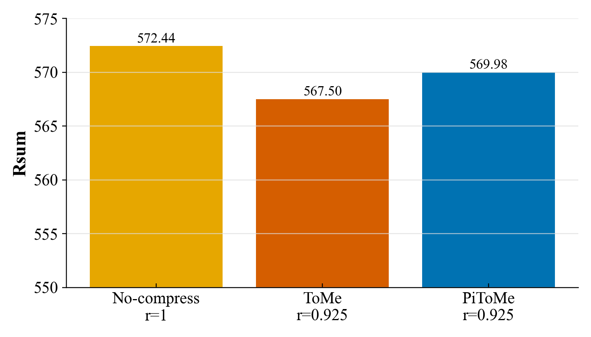

# DSAA5013 PiToMe Reproduction Project

## Introduction

This repository is for the DSAA5013 course project. It reproduces selected experiments from [Accelerating Transformers with Spectrum-Preserving Token Merging](https://arxiv.org/pdf/2405.16148), covering two tasks: **image-text retrieval** and **text classification**.

The paper proposes PiToMe, a token-merging method that accelerates Transformer models by merging redundant tokens while preserving informative token structure through a spectrum-preserving criterion. In this project, we compare PiToMe with ToMe as the baseline to evaluate the trade-off between computational cost and task performance.


## How to Run


Initialize the environment, including the conda environment, Python version, PyTorch backend, project dependencies from `requirements.txt`:

```bash
bash scripts/env/init_environment.sh
```


On a Slurm cluster, the same scripts can be submitted with `sbatch`:

```bash
sbatch scripts/env/init_environment.sh
```

After initialization, activate the environment before running the following scripts:

```bash
conda activate pitome
```


## Image Classification

This part evaluates DeiT image classification on ImageNet-1k. The experiments compare the uncompressed baseline with ToMe and PiToMe at the configured token-retention ratios.

Run image-classification evaluation:

First download ImageNet-1k. 
```bash
python scripts/env/download_imagenet1k.py --cache-dir data/ic
```

Then run scripts for different algorithms.

```bash
bash scripts/tasks/image_classification.sh pitome eval DEIT-T-224
bash scripts/tasks/image_classification.sh tome eval DEIT-T-224
```

On a Slurm cluster, the same scripts can be submitted with `sbatch`:

```bash
sbatch scripts/tasks/image_classification.sh pitome eval DEIT-T-224
sbatch scripts/tasks/image_classification.sh tome eval DEIT-T-224
```

### Datasets

- ImageNet-1k

### Model

- `DEIT-T-224`

### Main Results

Results are saved in `outputs/ic_output/eval-DEIT-T-224.csv`. The figure compares the GFLOPs-accuracy trade-off of PiToMe and ToMe. The no-compression baseline is marked as a star. When repeated rows are present in the CSV logs, the latest row for each method and ratio is reported.



The table reports the PiToMe FLOPs speedup, computed as `ratio 1.0 GFLOPs / current ratio GFLOPs`.

| Ratio | PiToMe FLOPs Speedup | PiToMe Acc. |
|---:|---:|---:|
| 1.0 | 1.00x | 72.14 |
| 0.9125 | 1.62x | 69.09 |
| 0.875 | 1.93x | 66.65 |
| 0.8375 | 2.28x | 62.46 |
| 0.8 | 2.69x | 55.68 |


## Text Classification

This part reproduces the text-classification task. The experiments evaluate PiToMe on BERT-Base with different token-retention ratios. To distinguish this setting from the image-classification task, we test a wider compression-ratio range here.


Prepare datasets:

```bash
bash scripts/env/download_tc_datasets.sh all
```

Run text-classification evaluation:

```bash
bash scripts/tasks/text_classification.sh pitome
bash scripts/tasks/text_classification.sh tome
```

On a Slurm cluster, the same scripts can be submitted with `sbatch`:

```bash
sbatch scripts/env/download_tc_datasets.sh all
sbatch scripts/tasks/text_classification.sh pitome
sbatch scripts/tasks/text_classification.sh tome
```

### Datasets

- SST-2
- Rotten Tomatoes
- IMDb

### Model

- `bert-base-uncased`

### Main Results

Results are saved in `outputs/tc_outputs/`:

The figure compares the GFLOPs-accuracy trade-off of PiToMe and ToMe. The no-compression baseline is marked as a star. When repeated rows are present in the CSV logs, the latest row for each method and ratio is reported.



The table reports the PiToMe FLOPs speedup, computed as `ratio 1.0 GFLOPs / current ratio GFLOPs`.

| Ratio | SST-2 FLOPs Speedup | SST-2 Acc. | Rotten FLOPs Speedup | Rotten Acc. | IMDb FLOPs Speedup | IMDb Acc. |
|---:|---:|---:|---:|---:|---:|---:|
| 1.0 | 1.00x | 92.52 | 1.00x | 96.78 | 1.00x | 92.65 |
| 0.9 | 1.29x | 91.85 | 1.30x | 96.42 | 1.32x | 92.26 |
| 0.8 | 1.76x | 90.18 | 1.77x | 94.56 | 1.84x | 91.68 |
| 0.7 | 2.43x | 86.38 | 2.44x | 91.34 | 2.66x | 90.37 |
| 0.6 | 3.51x | 81.70 | 3.55x | 83.44 | 3.97x | 87.11 |
| 0.5 | 5.22x | 73.66 | 5.38x | 72.90 | 6.23x | 81.69 |

## Image-text Retrieval

This part evaluates BLIP image-text retrieval on Flickr30k. The experiments compare the uncompressed baseline with ToMe and PiToMe at the configured token-retention ratio.

Prepare the Flickr30k data for LAVIS:

```bash
python tools/set_lavis_cache_root.py --cache-root /path/to/lavis_cache
python tasks/itr/download_flickr.py
```

Run image-text retrieval evaluation:

```bash
bash scripts/eval_scripts/eval_itr_assignment.sh
```

On a Slurm cluster, the same script can be submitted with `sbatch`:

```bash
sbatch scripts/eval_scripts/eval_itr_assignment.sh
```

The script uses the BLIP/Flickr30k config at:

```text
scripts/eval_scripts/blip_itr_flickr.yml
```

Runtime outputs are appended to:

```text
outputs/itr_output/eval_itr_BLIP.csv
```

### Datasets

- Flickr30k

### Model

- `blip`

### Main Results

The configured assignment results are saved in `outputs/itr_output/configured_results.csv`. The figure compares Flickr30k BLIP retrieval Rsum for the baseline, ToMe, and PiToMe.



| Dataset | Model | Method | Ratio | Ri@1 | Ri@5 | Ri@10 | Rt@1 | Rt@5 | Rt@10 | Rsum |
|---|---|---:|---:|---:|---:|---:|---:|---:|---:|---:|
| Flickr30k | BLIP | none | 1.0 | 83.50 | 96.64 | 98.30 | 94.43 | 99.60 | 100.00 | 572.44 |
| Flickr30k | BLIP | tome | 0.925 | 82.04 | 96.02 | 97.94 | 92.22 | 99.40 | 99.81 | 567.50 |
| Flickr30k | BLIP | pitome | 0.925 | 82.23 | 95.80 | 98.08 | 94.54 | 99.60 | 99.99 | 569.98 |

## Project Structure

```text
PiToMe/
├── algo/                  # PiToMe and ToMe token-merging implementations
│   ├── pitome/            # PiToMe merge logic and model patches
│   └── tome/              # ToMe baseline merge logic and model patches
├── tasks/                 # Task-specific datasets, models, and engines
│   ├── ic/                # Image classification code
│   ├── itr/               # Image-text retrieval code
│   └── tc/                # Text classification code
├── scripts/
│   ├── env/               # Environment and dataset download scripts
│   ├── tasks/             # Task launch scripts
│   ├── eval_scripts/      # Image-text retrieval evaluation configs/scripts
│   ├── plot_ic_results.py # Generate the image-classification figure
│   ├── plot_itr_results.py # Generate the image-text retrieval figure
│   └── compare_tc.py      # Generate the text-classification figure
├── tools/                 # Utility scripts
├── outputs/               # CSV logs and evaluation outputs
├── figures/               # Generated result figures
├── main_ic.py             # Image classification entry point
├── main_itr.py            # Image-text retrieval entry point
└── main_tc.py             # Text classification entry point
```
